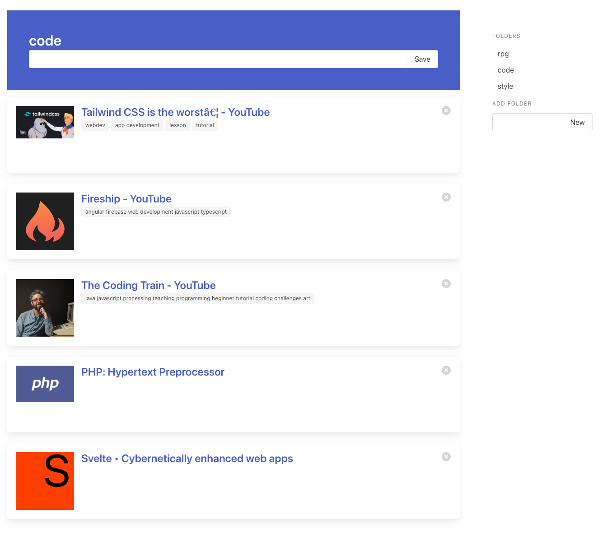

# Link Saver

This tool is designed to store URLs and make previews of them.

## Development environment

### Requirements
- PHP 8.2

### Run
You can test the app by running it with the following command : 
```
php -S 0.0.0.0:8000 -t public
```

## Configuration
You can check the different configuration available in the .env file.

## Screenshot



## Disclaimer

This project is intented for educational purpose, feel free to fork it if you wanna use it!